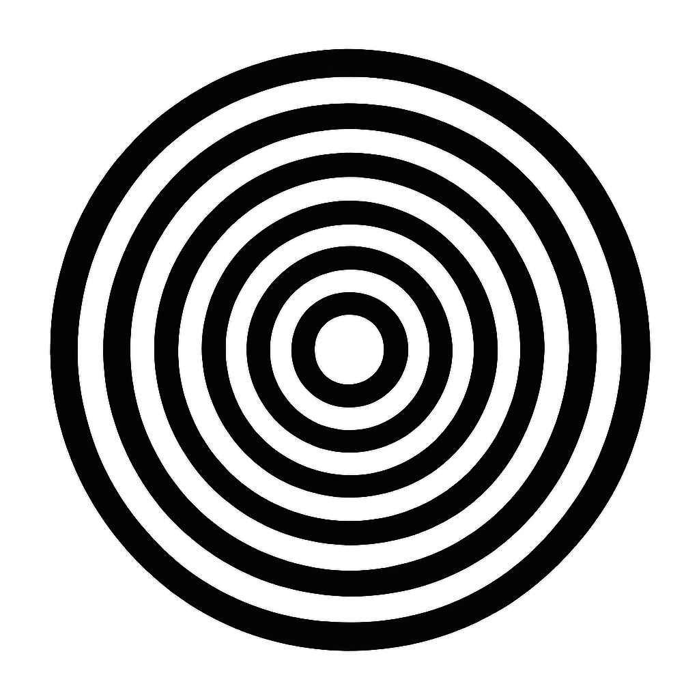

# portals

> _On the other side, something is waiting. It doesn’t remember why._

> _See you in the woods. FF 25._

## Setup - Jetson 

1. Install uv: `curl -LsSf https://astral.sh/uv/install.sh | sh`
2. Clone this repo and cd into it
3. Install dependencies: `uv sync`
4. Run: `uv run python python_code/arduino_keyboard.py`
5. Pressing the button will now be as pressing "0" or "1" on the main computer. 

## Setup - Arduino

1. Install Arduino IDE. 
2. Upload `arduino_code/button_keyboard.ino` to your Arduino 
3. Connect the first button between pin 2 and GND 
4. Connect the second button between pin 3 and GND 
5. Connect the Arduino to the Jetson. Check the serial port with `ls /dev/cu.*`. In `arduino_keypress.py`, update the `ARDUINO_PORT` to match. 

